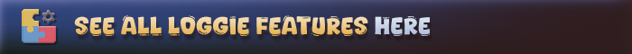
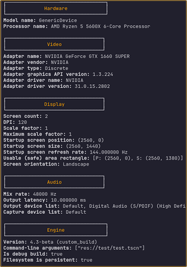
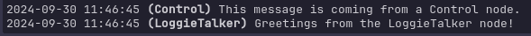
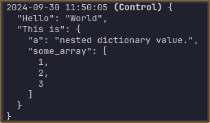
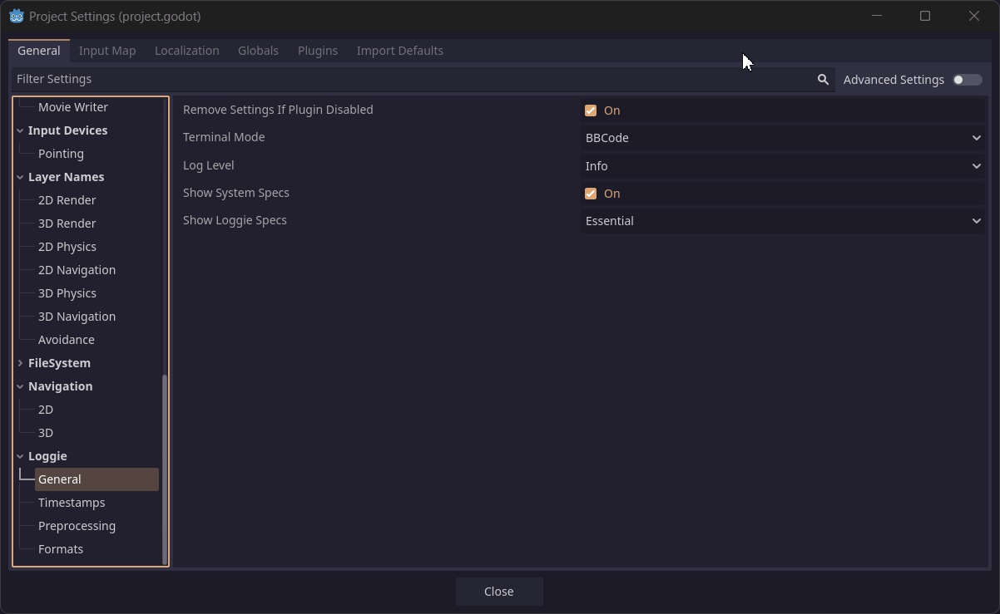

Loggie is a Godot string composer and logger developed for 4.0+, for those who could use a couple of improvements and more control over how console and logfile output is styled and handled.

It makes it a breeze to compose and print messages with all the extra data you need to have helpful logs.

```swift
// Simple
Loggie.error("Everything's in flames...")

// Customizable
Loggie.msg("Just kidding!").color("orange").bold().info() 

// Discover more below...
```

Loggie takes care that your logs always look clean in release builds, while allowing you to use extra styling for console targeted output. 

ANSI-compatible, and friendly both for solo developers and developers in a team (externally loaded settings for each developer).

If you need something simple but effective, Loggie is your guy.




-------------

# Installation

_(Loggie was developed for Godot 4.0+, and was not tested on older versions)_

This repository contains the entire Loggie development godot project, so there are files which are redundant in case you want to use Loggie only as a plugin for your project.
Choose which way you want to install:

### 💾 I want to use Loggie in my project
<details>
  <summary>
	  <b>Choose method...</b>
  </summary>
  <details>
    <summary><b>⚙️ Method 1 - Direct Download</b></summary>
    <br>
    <ol>
    <li>Clone or download this repository as a .zip.</li>
    <li>Copy the `addons/loggie` folder and place it in your `res://addons/` directory in your Godot project (if you don't have that folder, create it first).</li>
    <li><b>(Optional)</b>: Adjust the name of the Loggie singleton to something else if you don't want to use the default "Loggie" name. Read here how to do it: <a href="docs/USER_GUIDE.md#using-a-custom-singleton-name">📚 Using a Custom Singleton Name</a>. This is best done before first enabling the plugin.</li>
    <li>In Godot, go to Project -&gt; Project Settings -&gt; Plugins, and enable Loggie.</li><br>
    <br><br>
    <li>You're good to go. Have a peek at the <a href="docs/USER_GUIDE.md">📚 User Guide</a> for more details. </li>
    </ol>
  </details>
  
  <details>
	  <summary><b>⚙️ Method 2 - Godot Assetlib</b></summary>
	  <ol>
		<li>In Godot's top bar, click "AssetLib", and search for Loggie and click Install.</li>
		<li>Choose which directories to import and where.</li>
		<p>
		For plugin purposes, all you need is the `<i>/addons/loggie</i>` folder from this repository to be moved into your `<i>res://addons/</i>`. If you don't have that folder, create it first.
		Therefore, once you have it, you select <b>only</b> `/addons/loggie` to be added to your project. Your installation should look like this:
		</p>
		
    <br><br>
	<li><b>(Optional)</b>: Adjust the name of the Loggie singleton to something else if you don't want to use the default "Loggie" name. Read here how to do it: <a href="docs/USER_GUIDE.md#using-a-custom-singleton-name">📚 Using a Custom Singleton Name</a>. This is best done before first enabling the plugin.</li>
	<li>In Godot, go to Project -&gt; Project Settings -&gt; Plugins, and enable Loggie:</li>
	<br><br><br>
	<li>You're good to go. Have a peek at the <a href="docs/USER_GUIDE.md">📚 User Guide</a> for more details. </li>
	</ol>
  </details>
</details>

### 💾 I want to develop and contribute to Loggie
<details>
  <summary>
	  <b>Show details</b>
  </summary>
  <ol>
  <li>Clone or download the repository.</li>
  <li>Open Godot to the Project Manager splash screen .</li>
  <li>Click 'Import' and choose Loggie's `project.godot` file as target.</li>
  <li>Make sure to enable the Loggie plugin in the project if it is not already enabled by going to Project Settings -> Plugins.</li>
  </ol>
</details>

-------------

# Highlighted Features

##  Easy Message Composition and Customization

##### Step 1
Start composing a message with Loggie.msg(...):

```gdscript
Loggie.msg("Hello")
```

##### Step 2
Chain any other customizations you want onto it.

```gdscript
Loggie.msg("Hello").bold().color(Color.CYAN)
```

There is a variety of styling functions you can use, such as `bold()`, `italic()`, `color(color)`, `nl()`, `header()`, `box()`, etc.

##### Step 3
Call one of the output functions (`info`, `notice`, `warn`, `error`, `debug`) at the end of the chain to output the composed message at that debug level.

```gdscript
Loggie.msg("Hello").bold().color(Color.CYAN).info()
```

#### Alternatively
Use Loggie shortcuts if you don't need to apply additional LoggieMsg modifiers.

```gdscript
Loggie.error("Hello")
Loggie.info("Hello")
Loggie.notice("Hello")
Loggie.warn("Hello")
Loggie.debug("Hello")
```

##  BBCode/ANSI Terminal Compatibility

Loggie was made with different consoles in mind. As such, it can be configured so that your logs (and their stylings, including custom colors) appear properly in any terminal with ANSI support.

This is great for users who prefer to develop Godot projects with VSCode or some other external editor which displays logs in a non-godot console.


##  Automatically makes clean plaintext logs in Release builds

Loggie can create some fancy looking output, but you don't want to open a .log file from an user who ran your project on release and realize your .log files are filled with BBCode or ANSI sequences, which were helpful during development... but now are simply creating a mess.

Loggie automatically switches to producing clean plaintext logs when it detects that your project is running in Release mode.

##  Device Specs Output

The logger can be configured to log the specs of the device running your project at launch, giving you a neat overview of all the details you may be interested in for debugging purposes.



##  Team Environment Support

Using Loggie as a solo developer is a smooth experience, but when working with teams, different teammates may desire to configure their logger (at least during local development) to use different features or styles of output.

To avoid pushing such changes to the Loggie plugin files directly, and to your repository, loggie allows you to boot a custom local settings file.

By gitignoring and using that file, each team member can use their own settings.

##  Toggleable Message Domains (Channels)

Messages can be configured to belong to a domain, and domains can be easily enabled or disabled. Messages coming from a disabled domain won't be processed or output.
This makes it simple to create functions that can output verbose and advanced logs related to their behavior only when the domain is enabled by the developer.

For example, you may want to print out every detail about how your Loot generator rolls chances for items: which number it rolled, was it a success or not, etc. - but you only want to see these diagnostics when you specifically enable them in that function:

```gdscript
func generate_loot_for(recipient : Creature):
  var diagnostics_enabled = true
  Loggie.set_domain_enabled("LootDiag", diagnostics_enabled)

  Loggie.msg("Generating loot for %s" % recipient.name).domain("LootDiag").info()
  Loggie.msg("Rolling for rare items...").domain("LootDiag").info()
```

##  Class Name Extraction

A neat feature I saw in [LogDuck](https://github.com/ZeeWeasel/LogDuck) _(also a cool logging library worth checking out)_, which allows you to see the names of the classes that prompted Loggie to output something.
\* This only works when the engine debugger is connected, therefore it does not work in Release mode, and won't be shown in those logs.\*



##  Dictionary Pretty-print

Loggie makes an extra step to pretty-print dictionaries, outputting them in a json-like format with newlines and tabs, instead of having them smushed into a single line, which makes reading printed dictionaries easier when dealing with larger ones.



##  All Basic Settings in Project Settings

Loggie creates new Project Settings in your Godot when it's used, allowing you to modify your Loggie preferences from the comfort of the Project Settings GUI.



##  Detailed In-Engine Documentation

Loggie's classes, variables and methods are all well documented and browsable directly in your Godot engine.
Head to the 'Search Help' window in Godot and search for Loggie to check it out.

If you need help with anything, feel free to reach out on the [Loggie discord server](https://discord.gg/XPdxpMqmcs).


# Development and Contributions

To ensure the best experience, please follow the guidelines:

##### I have a cool feature I'd like to suggest!
> Absolutely - Would love to hear it. You can open an issue titled 'Feature Request - ...' and describe the feature, or you can join the [Loggie Discord](https://discord.gg/XPdxpMqmcs) and bring it up there for further discussion.

##### I want to contribute code.
> Contributions for any [active issues](https://github.com/Shiva-Shadowsong/loggie/issues) or [tasks](https://github.com/users/Shiva-Shadowsong/projects/2) are most welcome.
> 
> Development of new features and fixes is done on the `dev` branch marking the latest (unreleased) version.

> Upon version completion, a version number is given to the new content, and it is merged into `main`, then [released](https://github.com/Shiva-Shadowsong/loggie/releases) with a new tag, and uploaded to the AssetLib.
> 
> Please make Pull Requests targeted at the latest `dev` branch.

##### I have a problem I'd like to report.
> Head on over to the [Issues page](https://github.com/Shiva-Shadowsong/loggie/issues) and create a new entry describing the issue you're facing and how to reproduce it.

-------------------------------------------------------------------
<center></center>

# About the project

It was developed for private use on a small project, but I decided to open-source it as I think it can be a very useful tool for anyone with basic logging needs with some extra focus on style.

I find tremendous reading comprehension value in adequately stylized and subdivided log messages, however, others on the team may have different preferences. Therefore, the main problems I aimed at with Loggie were:

1. Intuitive and easy flow for composing stylized messages.
2. Preferences for Settings that can easily be configured by each developer on the team locally without modifying the plugin itself.
3. Regardless of which styling is used during local development, when switched into "Production/Release" mode (ideally by automatically detecting that), the logger should create clean plaintext output in the actual .log files.

For anyone else who finds those things on the forefront of what they want their logger to achieve, Loggie is a great choice.

I'm looking to improve Loggie over time with more features, flexibility, stylings and so on. If you would like to Contribute, please read the Contributing section above.

-------------------------------------------------------------------
###### Attribution
Icons:
<a href="https://www.flaticon.com/free-icons/document" title="document icons">Freepik - Flaticon</a>
<a href="https://www.flaticon.com/free-icons/bracket" title="bracket icons">Bracket icons created by Mayor Icons - Flaticon</a>
<a href="https://www.flaticon.com/free-icons/price-label" title="price label icons">Price label icons created by juicy_fish - Flaticon</a>
<a href="https://www.flaticon.com/free-icons/technical" title="technical icons">Technical icons created by shmai - Flaticon</a>
<a href="https://www.flaticon.com/free-icons/device" title="device icons">Device icons created by syafii5758 - Flaticon</a>
<a href="https://www.flaticon.com/free-icons/message" title="message icons">Message icons created by Freepik - Flaticon</a>
<a href="https://www.flaticon.com/free-icons/log" title="log icons">Log icons created by Laisa Islam Ani - Flaticon</a>
<a href="https://www.flaticon.com/free-icons/draw" title="draw icons">Draw icons created by Freepik - Flaticon</a>
<a href="https://www.flaticon.com/free-icons/settings" title="settings icons">Settings icons created by Freepik - Flaticon</a>
<a href="https://www.flaticon.com/free-icons/discord" title="discord icons">Discord icons created by Hight Quality Icons - Flaticon</a>