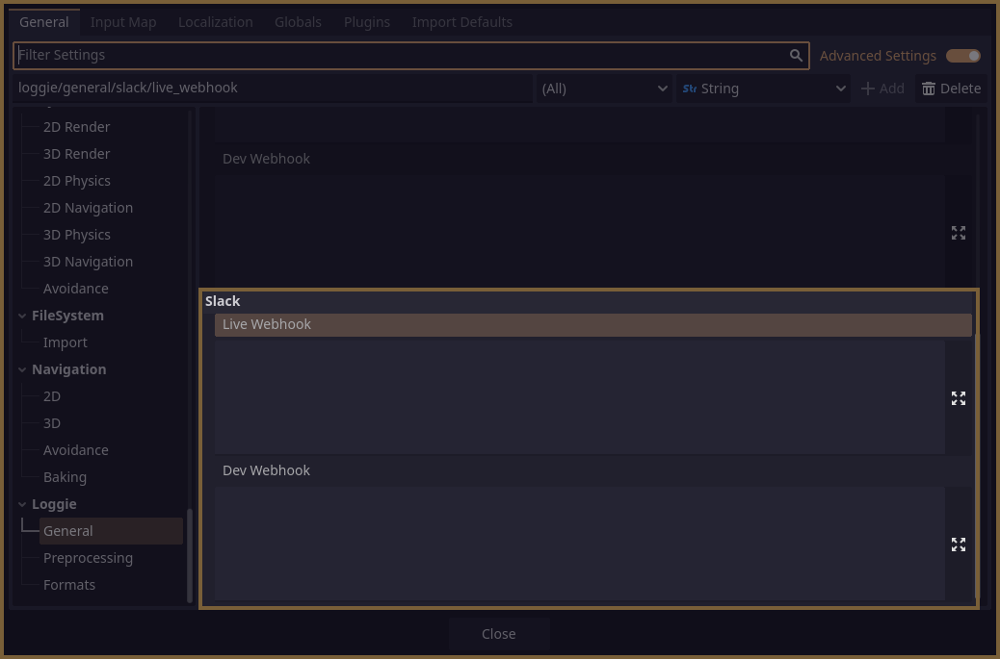
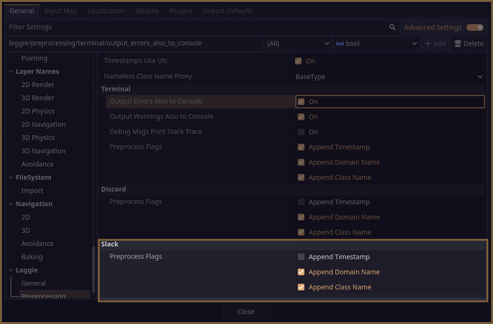

# Slack Channel

This channel comes installed with Loggie by default.

When it receives a message, it first prepares it to show up on Slack properly:

* Converts its content to the **PLAIN** [Output Format Mode](../features/OUTPUT_FORMAT_MODES.md).

Then, it posts the content to the Slack webhook that can be configured in **Project Settings -> Loggie -> General -> Slack -> Live Webhook / Dev Webhook**.

> [!INFO]
> You can generate a webhook in your Slack workspace by right clicking on a desired channel and going to **View Channel Details -> Integrations -> Apps (Add an App) -> Incoming Webhooks -> Configuration -> Add To Slack -> Post To Channel (choose channel) -> Add Incoming Webhooks Integration**

> [!CAUTION]
> ## **NEVER INCLUDE WEBHOOKS IN PUBLIC BUILDS.**
> 
> Doing so is a security risk! Use the `discord/slack` feature at your own discretion. It is best used for in-house tools, server-type applications and private projects.
>   
> For a safer public facing implementation - consider using a custom URL endpoint to send the request to one of **your own** servers which has a restrictive middleware handler that can deal with the request safely.
> 
> You can also implement your own version of these channels and deal with the issue in whichever way suitable. 

Furthermore, you can customize the features of this channel in **Project Settings -> Loggie -> Preprocessing -> Slack**:

In the end, you should receive your message in your Slack workspace, like in this example:

---
#### Related Articles:
👀 **► [Browse All Features](../../docs/ALL_FEATURES.md)**
📚 ► [What are Channels?](../../docs/features/CHANNELS.md)
📚 ► [Adding Custom Channels](../../docs/customization/ADDING_CUSTOM_CHANNELS.md)
📚 ► [Domains](../../docs/features/DOMAINS.md)