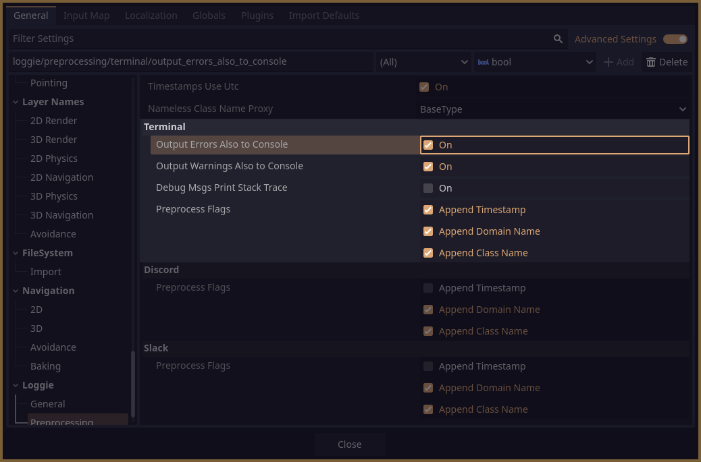

# Terminal Channel

This channel comes installed with Loggie by default.

When it receives a message, it converts its content to the appropriate [Output Format Mode](../features/OUTPUT_FORMAT_MODES.md) (according to what you chose in Loggie Settings).

Then it outputs the converted content to the standard output *(to the connected console)*.

The features of this channel can be customized in **Project Settings -> Loggie -> Preprocess -> Terminal**

---
#### Related Articles:
👀 **► [Browse All Features](../../docs/ALL_FEATURES.md)**  
📚 ► [What are Channels?](../../docs/features/CHANNELS.md)  
📚 ► [Adding Custom Channels](../../docs/customization/ADDING_CUSTOM_CHANNELS.md)  
📚 ► [Domains](../../docs/features/DOMAINS.md)  