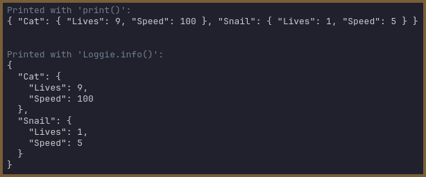

# Custom String Conversion

Loggie is *just a tiny bit* opinionated when it comes to how certain specific Objects (ehm... Dictionaries) should be represented as strings in the messages it processes.

Let's have a look at what that means. Take the following code for example:

```gdscript
var animals = {
	"Cat" : {"Lives": 9, "Speed" : 100},
	"Snail" : {"Lives": 1, "Speed" : 5}
}

func _ready():
	print(animals) # Print animals with Godot print
	Loggie.info(animals) # Print animals with Loggie
```

And you'll see the results are quite different:



However, Loggie's opinions should not trump your own, should you decide you want something done differently. This is why it's possible to customize how Loggie converts anything into a string.

Let's see how this stuff works:
## The Default String Converter

The default converter function is `LoggieTools.convert_to_string`, which is a rather short function you can see in `LoggieTools` [here](https://github.com/Shiva-Shadowsong/loggie/blob/main/addons/loggie/tools/loggie_tools.gd#L28). 

When Loggie is initializing (inside of `Loggie._init()`), it executes the following line of code:

```gdscript
	# Set the default custom string converter.
	self.settings.custom_string_converter = LoggieTools.convert_to_string
```

which makes Loggie use that function to convert stuff to strings.
## Your Custom String Converter

As you can imagine, you can simply set the aforementioned value to a different Callable to override that behavior and make Loggie use another implementation. 

There are only 3 small but **important rule**s you need to follow when changing the value of the `custom_string_converter` to your own value:

1. Your value must be a `Callable` function.
2. It must receive 1 parameter of type `Variant` (any type).
3. It must return a `String`.

Optionally, it should implement a way to convert a `LoggieMsg` object into a string by calling `.string()` on it. This will make Loggie behave as expected when merging multiple `LoggieMsgs` together.

When we apply these rules, we end up with something like this:

```gdscript
var my_converter : Callable = func(something : Variant):
	if something is LoggieMsg:
		return something.string()
	return str(something)
```

You can take it from there, and add custom conversion rules for other types to your liking.

To start using your converter instead of the default one, execute this anywhere after Loggie has initialized (but before you start using Loggie for logging messages):

```gdscript
Loggie.settings.custom_string_converter = my_converter
```

If you are [using Custom Settings](../customization/CUSTOM_SETTINGS.md), you can set this in the `load()` method directly instead:

```
custom_string_converter = my_converter
```


> [!NOTE]
> ##### Why not rely on `_to_string()` overrides to do this job?
> 
> As of right now, I don't know of any way to override the `_to_string()` method on native classes (such as `Dictionary`, `Array`, `Node`, etc.) through GDScript.
> 
> Therefore, without some custom solution, it was impossible to implement something like that pretty-printing of Dictionaries.

#### Related Articles:
👀 **► [Browse All Features](../ALL_FEATURES.md)**
📚 ► [Using Custom LoggieSettings](../customization/CUSTOM_SETTINGS.md)