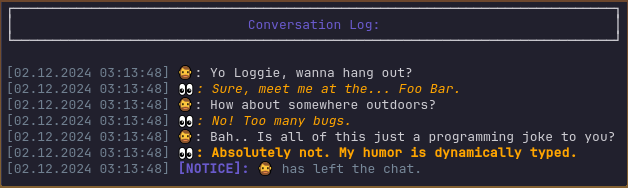

*This article assumes you're already familiar with [Composing and Outputting Messages](../features/COMPOSE_AND_OUTPUT_MESSAGES.md).*
### Styling Messages



Log browsability and readability is at the forefront of what Loggie sets out to achieve. 
And what better way to do that, than with various styles and colors that clearly separate, highlight and outline certain messages?

We can chain various `LoggieMsg` methods onto the message to apply one or multiple styles.
For example:

```gdscript
# Make a box with 30 horizontal padding and blue text inside.
var title = Loggie.msg("Conversation Log:").color(Color.SLATE_BLUE).box(30)

# We disable preprocessing for this message so it doesn't get timestamps and other modifications appended to it.
title.preprocessed(false) 

title.info()

# Here are some other stylized messages:
Loggie.msg("Bye Loggie!").bold().info()
Loggie.msg("Cache you later!").prefix("👀").color("orange").italic().info()
```

Below is a list of all styling functions you can use.

> [!WARNING]
> Unless documentation indicates otherwise, all modifications by these methods are done to the **current content segment** of the message, and won't apply to any additional content that is appended to that same message afterwards.

------------
##### bold()
> Makes the current segment of this message bold.

```gdscript
Loggie.msg("I'm bold.").bold().info()
```


------------
##### italic()
> Makes the current segment of this message italic.

```gdscript
Loggie.msg("I'm italic.").italic().info()
```


------------
##### header()
> Stylizes the current segment of this message as a header.
> You can adjust how this appears in the `format_header` setting.
> Headers are by default "bold + italic".

```gdscript
Loggie.msg("This is a header.").header().info()
```
 

------------
##### color(color : String | Color)
> Wraps the current segment of this message in the given color. The color can be provided as a Color, a recognized Godot color name (String, e.g. "red"), or a color hex code (String, e.g. "#ff0000").

```gdscript
Loggie.msg("Hello.").color(Color.RED).info()
Loggie.msg("Hello.").color("#ff0000").info()
```


> [!WARNING]
> Loggie uses `print_rich` under the hood to print stylized messages. Unfortunately, as of right now, Godot's BBCode color parser for that function only officially supports a small sub-set of colors in full.
> 
> If you are using `TerminalMode.BBCODE` and use an unsupported color - your logs **WILL NOT** end up having the BBCode of that color stripped from them. 
> 
> This is not a concern for Release/Production builds because Loggie automatically uses `TerminalMode.PLAIN` in that circumstance - which strips *all* BBCode.
> 
> The list of supported colors can be found in the documentation of the `print_rich` method - `black, red, green, yellow, blue, magenta, pink, purple, cyan, white, orange, gray`

------------
##### nl(amount: int = 1)
> Adds the specified amount of newline characters to the end of the current segment.

```gdscript
Loggie.msg("New line after me.").nl().info()
```

------------
##### tab(amount: int = 1)
> Adds the specified amount of tab characters to the end of the current segment.

```gdscript
# Add 2 tabs between these 2 words.
Loggie.msg("Left").tab(2).add("Right").info()
```

------------
##### space(amount: int = 1)
> Adds the specified amount of space characters to the end of the current segment.

```gdscript
# Add 10 spaces between these 2 words.
Loggie.msg("Left").space(10).add("Right").info()
```

------------
##### box(h_padding: int = 4)
> Constructs a decorative box with the given horizontal padding around the current segment of this message. Messages containing a box are not going to be preprocessed, so they are best used only as a special header or decoration.

> You can adjust how the box is constructed in the `box_symbols_compatible` and `box_symbols_pretty` advanced setting.

> You can choose which box type to use with the Loggie Project Settings -> Preprocessing -> Box Characters Mode setting.

```gdscript
Loggie.msg("Let me oooout.").box(6).info()
```


------------
##### hseparator(size: int = 16, alternative_symbol: Variant = null)
> Appends a horizontal separator with the given length to the message. If alternative_symbol is provided, it should be a String, and it will be used as the symbol for the separator instead of the default one.

```gdscript
# Adds a new line 
Loggie.msg("Very important business.").header().nl().hseparator(20).info()
```


------------
##### add(...)
> Converts the provided arguments to strings and appends them to the end of the current content.
> 
> * If an argument is a `Dictionary`, it will be converted with the pretty-print format. 
> * If an argument is `LoggieMsg`, that message's content will be merged into this message's content.

```gdscript
# Basic usecase
Loggie.msg("Hello ").add("World").info()

# Merging msg2 into msg1:
var msg1 = Loggie.msg("Hello").bold()
var msg2 = Loggie.msg("World").color("yellow")
msg1.add(msg2).info()
```

------------
##### prefix(prefix : String, separator : String = "")
> Prepends the given prefix string to the start of the whole message (first segment) with the provided separator.

```gdscript
Loggie.msg("After").prefix("Before").info()
```

------------

##### suffix(suffix : String, separator : String = "")
> Appends the given suffix string to the end of the message (last segment) with the provided separator.

```gdscript
Loggie.msg("Before").suffix("After").info()
```

---
> [!TIP]
> ### 🎉 Let's go! 🥳 
> You're on your way to becoming a Loggie pro!
> This concludes the part 2 of the guide on how to work with Loggie Messages.
> Other related articles:
> 
> * ### 📚 [Part 1 - Compose and Output Messages](../features/COMPOSE_AND_OUTPUT_MESSAGES.md)
> * ### 📚 > Part 2 - Styling Messages
> * ### 📚 [Part 3 - Segmenting Messages](SEGMENTING_MESSAGES.md)
>   
>  👀 **► [Browse All Features](../ALL_FEATURES.md)**


