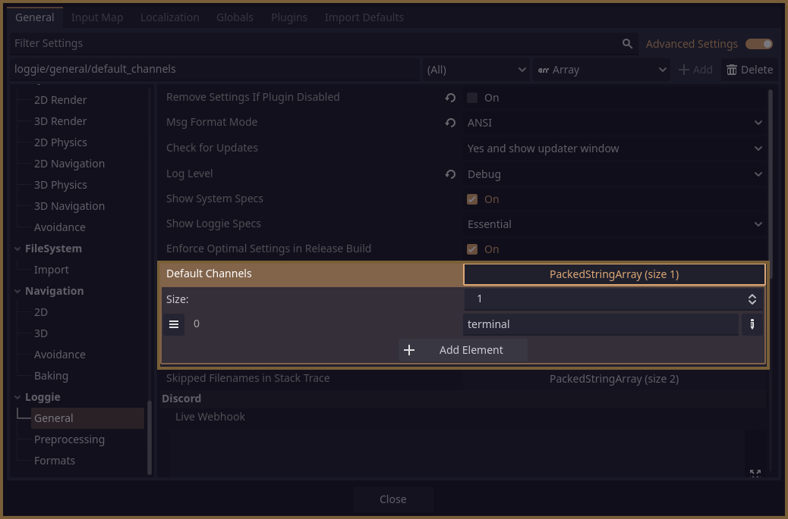

# What are Channels?

After Loggie finishes verifying and [preprocessing](PREPROCESSING.md) a message, it sends it to one *(or multiple)* channels.

The channel is then responsible for post-processing and doing something with the message.

Basically, the channel has the final say in how the message ends up looking, and how it ends up being sent to whatever medium is supposed to receive / display it.

There are 3 channels that come installed with Loggie by default:
* [Terminal](docs/channels/CHANNEL_TERMINAL.md)
* [Discord](docs/channels/CHANNEL_DISCORD.md)
* [Slack](docs/channels/CHANNEL_SLACK.md)

Every LoggieMsg is sent out to *some* channel to be handled when you use methods like `info`, `error`, `warn`, etc.

Loggie dictates which channel(s) that's going to be by default, by reading the `default_channels` setting. This setting can be seen and changed in **Project Settings -> Loggie -> General -> Default Channels.**



If you are [using Custom Settings](../customization/CUSTOM_SETTINGS.md), you can set this in the `load()` method instead:

```
default_channels : PackedStringArray = ["terminal"]
```

### Outputting a specific message to a specific channel

If you want to output a specific message to some other channel(s) other than the default one - the method `LoggieMsg.channel` can be used to specify it.

Let's look at some examples:

```gdscript
# This message has no channel specified, so it will default to being sent to all channels that are configured in LoggieSettings.default_channels.
Loggie.msg("Hello terminal!").info()

# This message will be sent to the terminal channel:
Loggie.msg("Hello terminal!").channel("terminal").info()

# This message will be sent to the discord channel.
Loggie.msg("Hello terminal!").channel("discord").info()

# This message will be sent to both channels:
Loggie.msg("Hello terminal!").channel(["discord", "terminal"]).info()
```

## Adding a Custom Channel

This is covered in a [different article here](../customization/ADDING_CUSTOM_CHANNELS.md).

---
#### Related Articles:
👀 **► [Browse All Features](../ALL_FEATURES.md)**  
📚 ► [Adding Custom Channels](../customization/ADDING_CUSTOM_CHANNELS.md)  
📚 ► [Domains](DOMAINS.md)  
📚 ► [Using Custom LoggieSettings](../customization/CUSTOM_SETTINGS.md)  

