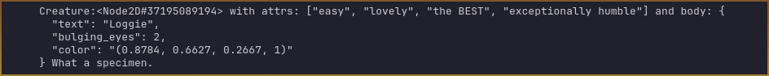

#  Message Composition and Customization

*This article is part 1 of a three-part guide to starting out with Loggie. More at the bottom.*
## Quick Output

If you have no desire to stylize your message and simply want to output at a [log level](LOG_LEVELS) quickly, you can use the shortcut functions:

```swift
Loggie.error("Message")

Loggie.warn("Hello")

Loggie.notice("Hello")

Loggie.info("Hello")

Loggie.debug("Hello")
```

This is the simplest and fastest way to get loggie to output a message.

However, Loggie can do much more to help you compose and log complex multi-part messages with stylings, and so on. Let's dive deeper below.

> [!TIP]
> What's the difference between these methods?
> [Read more in the Log Levels article here.](LOG_LEVELS.md)

---
##  Composing Messages

### Creating and Logging a "LoggieMsg"
All messages Loggie works with are instances of [LoggieMsg](addons/loggie/loggie_message.gd), a string composer class that comes with a ton of utilities for customizing a message. 

To create a `LoggieMsg` and fill it with some starting content, we can use the `Loggie.msg(...)` shortcut method:

```gdscript
Loggie.msg("Hello world.")
```

This method actually returns the `LoggieMsg` that was created, so you can store it in a variable and keep it alive for a while as you keep modifying it:

```gdscript
var msg = Loggie.msg("You look in the mirror. You see ")

## later on...
if creature.type == Types.Dog:
	msg.add("a goodest boy.")
else:
	msg.add("an incredible game developer.")
```

Pretty much *all* of the `LoggieMsg` methods return the same message that you just modified.
Which means we can use that to chain method calls together as much as we want and have our modifications flow seamlessly in a single line:

```gdscript
Loggie.msg("You").add("spin me").add("right round").add("baby").add("🎶🥁🎶")
# Your tech lead might choke you out if they find emojis in the logs.
```

When you are ready to output the message, call one of the output methods on it.
There is one method for each [log level](LOG_LEVELS.md):

```gdscript
msg.error()   msg.warn()   msg.notice()   msg.info()   msg.debug()
```

## Concatenating Content

Did you notice something up there? The method `add` was used to add more content to an existing message. There are many ways to fill up your message with multiple instances of concatenated data.

Let's check that out:

```gdscript
# In a single 'msg' call:
var msg = Loggie.msg("You", "can", "use", "six", "parameters", "max")

# Need more? Let's "add" more:
msg.add("we", "could", "really", "go", "on", "endlessly")

# What about some other types of data? ...
```

## Different Types of Data in a Message
We are not limited to only concatenating strings. You can add **anything** into your message!
<span style="color:gray;font-weight: bold;font-size:7px">Just not emojis. I told you, you'll be put on a damn watchlist.</span>

```gdscript
var creature = load("res://Creature.tscn").instantiate()
var attributes = ["easy", "lovely", "the BEST", "exceptionally humble"]
var body = {
	"text" : "Loggie",
	"bulging_eyes" : 2,
	"color" : Color("#e0a944"),
}
var finalRemarkMsg = Loggie.msg("What a specimen.")

Loggie.msg("We have a", creature, "with attrs:", attributes, "and body:", body, finalRemarkMsg).info()
```

Result:



As a keen observer, you'll notice that we can even merge one  `LoggieMsg`  into another.

---

> [!TIP]
> ### 🎉 Let's go! 🥳 
> You're on your way to becoming a Loggie pro!
> This concludes the part 1 of the guide on how to work with Loggie Messages.
> Other related articles:
> 
> * ### 📚 > Part 1 - Compose and Output Messages
> * ### 📚 [Part 2 - Styling Messages](../customization/STYLING_MESSAGES.md)
> * ### 📚 [Part 3 - Segmenting Messages](../customization/SEGMENTING_MESSAGES.md)
> 
> 👀 **► [Browse All Features](../ALL_FEATURES.md)**