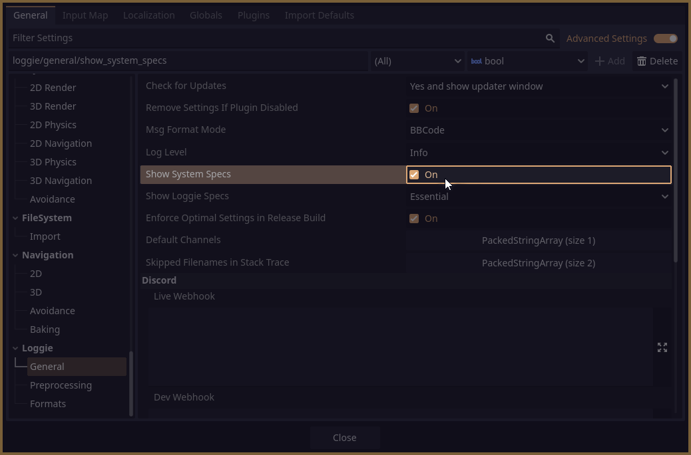

##  Device Specs Output

Loggie can be configured to log the specs of the device running your project at launch, giving you a neat overview of all the details you may be interested in for debugging purposes.


To enable this behavior, go to **Project Settings -> Loggie -> General -> Show System Specs**:



If you are [using Custom Settings](../customization/CUSTOM_SETTINGS.md), you can set this in the `load()` method instead:

```
show_system_specs = true
```

---
#### Related Articles:
👀 **► [Browse All Features](../ALL_FEATURES.md)**  
📚 ► [Using Custom LoggieSettings](../customization/CUSTOM_SETTINGS.md)  

👋 *Credits to [ZeeWeasel/LogDuck](https://github.com/ZeeWeasel/LogDuck) for the idea and initial implementation.* 