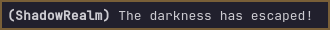
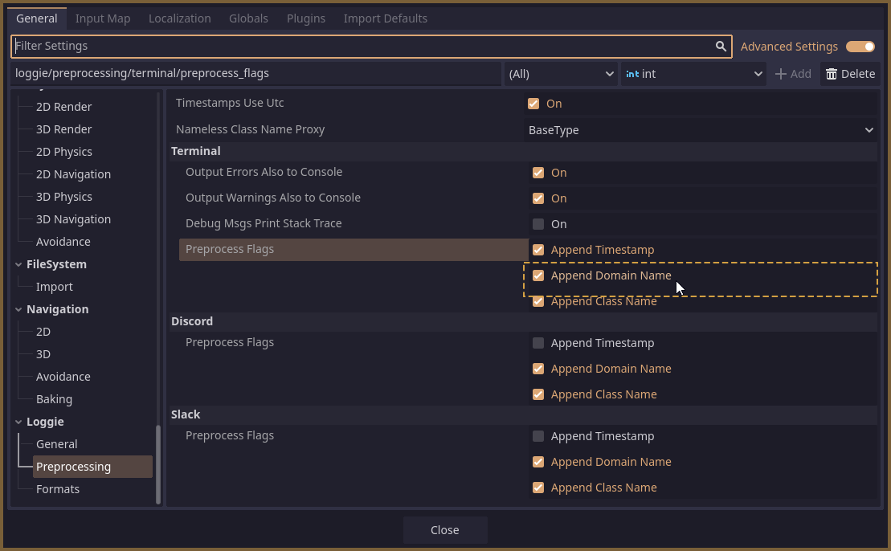

# What are Domains?

Domains are a feature which allow you to place any message into a named category (called *a domain*).

Then, domains can be easily enabled, disabled, or customized to always output messages that belong to them to specific [channels](CHANNELS.md).

### Using Domains

Each domain is uniquely identified by its name (*a string*).
The default domain to which all messages belong is `""` (*empty string*).

To put a specific message into a domain, call the `domain` method on it and provide it with the name of the domain:

```gdscript
# Outputs this message via the 'ShadowRealm' domain.
Loggie.msg("Hello").domain("ShadowRealm").info()
```

### Toggling Domains

Domains can be enabled or disabled.

If a domain is disabled, and a message attempts to be outputted through that domain - the message will be ignored and not outputted.

> [!IMPORTANT]  
> All domains, except the default `""` domain, **are DISABLED** by default.
> 

You can enable domains by calling `Loggie.set_domain_enabled`:

```gdscript
	# Enables the ShadowRealm domain.
	Loggie.set_domain_enabled("ShadowRealm", true)
	
	# Tries to output a message via the ShadowRealm domain.
	# (and succeeds, because it's now enabled)
	Loggie.msg("The darkness has escaped!").domain("ShadowRealm").info()
```

### Showing Domain Names Next To Messages



If you want to show the domain from which a message is coming, you can toggle the following setting for that channel in **Project Settings -> Loggie -> Preprocessing**:



If you are [using Custom Settings](../customization/CUSTOM_SETTINGS.md), you can set this in the `load()` method instead:

```
output_message_domain = true
```

### Changing How Domain Name is Displayed

This is covered in the [Message Formats](../customization/MESSAGE_FORMATS.md) article.

### Making a Domain Always Post to Specific Channels

If you want all messages from some domain to go to a specific channel (or channels), you can use the third parameter of the `Loggie.set_domain_enabled` function to pass the desired channels when enabling the domain:

```
# Single channel
Loggie.set_domain_enabled("ShadowRealm", true, "discord")

# Multiple channels
Loggie.set_domain_enabled("ShadowRealm", true, ["terminal", "discord"])
```

By default, all domains post to whatever your *default channels* are configured to be in Loggie Settings.

## How are domains useful?

Let's say you are developing a complex system within a single (or even multiple) scripts, and you find it very helpful to have debug logs scattered throughout that system which inform you of its operations.

However, you only want to see these logs while you are developing the system, and later when you come back to maintain or upgrade the system. In the meantime, you'd like these logs to be disabled.

Well, you can place all of your logs within this script into a domain, and then toggle that domain enabled only when you need those logs.

💡 **Here is a practical example of how you could structure domains.**

Set up an autoload where you can neatly store a list of all domains in your game.
This autoload can enable all domains you want to use on `_ready`:

```
# This is an autoload.
class_name LoggieDomainsManager extends Node

var my_domains = {
	"LootSystem" : true,
	"CreatureSystem" : false
}

func _ready():
	for domain_name in my_domains.keys():
		Loggie.set_domain_enabled(domain_name, my_domains[domain_name])
```

Then, let's say you are developing the `LootSystem`, which has footprints in multiple classes:

```
class LootManager extends RefCounted

var possibilities = {}

func _ready():
	pass

func add_possibility(itemID : String, chance : float):
	possibilities[itemID] = chance

func generate() -> Array[String]:
	var generated_loot = []

	for itemID in possibilities.keys():
		if randi_range(1,100) <= possibilities[itemID].chance:
			generated_loot.push_back(itemID)
			Loggie.msg("Successfully generated: ", itemID).color("green").domain("LootSystem").debug()
		else:
			Loggie.msg("Chance failed for: ", itemID).color("red").domain("LootSystem").debug()

	return generated_loot
```

```gdscript
class Creature extends Node

var owned_items : Array[String] = []
var loot : LootManager = LootGenerator.new()

func _ready():
	loot 

func add_item(itemID : String):
	owned_items.push_back(itemID)

func on_death(killer : Creature):
	Loggie.msg("Generating loot from", self, "to give to", killer).domain("LootSystem").debug()
	var dropped_loot = loot.generate()
	for itemID in dropped_loot:
		killer.add_item(itemID)
```

Now, when you enable the "LootSystem" domain in your `LoggieDomainsManager`, you will see messages related to the loot system coming from both the `Creature` and `LootManager` classes.

When you disable it - poof, all the logs from these multiple related scripts are gone.

---
#### Related Articles:
👀 **► [Browse All Features](../ALL_FEATURES.md)** 📚 ► [Prev: Log Levels](LOG_LEVELS.md)  
👀 ► **[Back to User Guides](../USER_GUIDE.md)**  

📚 ► [Channels](CHANNELS.md)  
📚 ► [Message Formats](../customization/MESSAGE_FORMATS.md)  
📚 ► [Using Custom LoggieSettings](../customization/CUSTOM_SETTINGS.md)  
