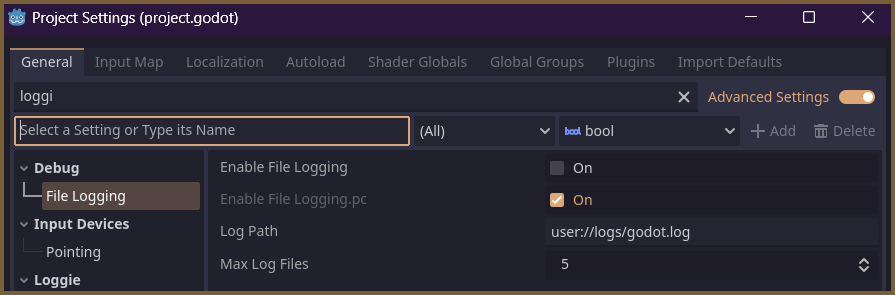

# Log Files and Storage

Godot already has a neat default logging system which takes care of generating `.log` files for  messages printed with `print` (and similar functions) and auto-deprecating them when certain thresholds are reached.

Loggie is not reinventing anything in this regard, therefore, if you read about how Godot's default logging system works, you'll know what to expect from Loggie, since it relies on Godot's log system under the hood to generate `.log` files.

You can modify the properties for logging in the **Project Settings -> Debug -> File Logging** tab.

Hover over each setting for more information.

---
#### Related Articles:
👀 **► [Browse All Features](../ALL_FEATURES.md)**