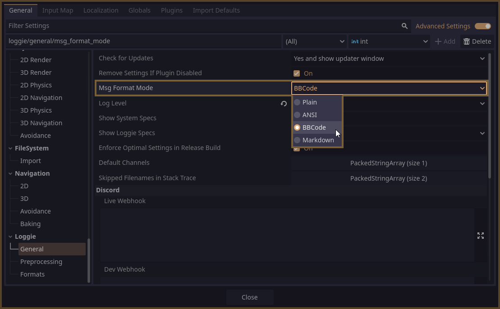

# Using Loggie with Non-Godot Editors

Loggie was made with different consoles in mind. As such, it can be configured so that your logs (and their stylings, including custom colors) appear properly in any terminal with ANSI support.

This is great for users who prefer to develop Godot projects with VSCode or some other external editor which displays logs in a non-godot console.


You only have to make sure to switch your [Output Format Modes](OUTPUT_FORMAT_MODES.md) to **ANSI**, otherwise, message styles will not render in the external console correctly.

You can do that in **Project Settings -> Loggie -> General -> Msg Format Mode**:



Read more about [Output Format Modes here](OUTPUT_FORMAT_MODES.md).

If you are [using Custom Settings](../customization/CUSTOM_SETTINGS.md), you can set this in the `load()` method instead:

```
msg_format_mode = LoggieEnums.MsgFormatMode.ANSI
```

---
#### Related Articles:
👀 **► [Browse All Features](../ALL_FEATURES.md)**  
👀 ► **[Back to User Guides](../USER_GUIDE.md)**  

📚 ► [Output Format Modes](OUTPUT_FORMAT_MODES.md)  
📚 ► [Using Custom LoggieSettings](../customization/CUSTOM_SETTINGS.md)  
📚 ► [Log Levels](LOG_LEVELS.md)  